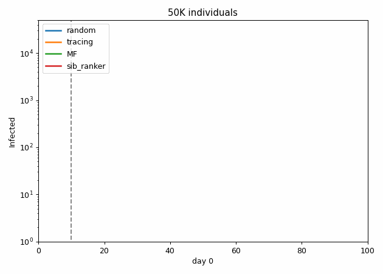

# epidemic_mitigation

epidemic_mitigation is a framework to test the perfomances of scoring algorithms that could be used to improve the identification of infected individuals using digital contact tracing data.  

We employ realistic individual-based models ([OpenABM-Covid19](https://github.com/BDI-pathogens/OpenABM-Covid19)) to investigate a number of intervention strategies aiming at containing epidemic outbreaks, such as case-based measures (e.g. individual and household quarantine and mobility restrictions).  

[OpenABM-Covid19](https://github.com/BDI-pathogens/OpenABM-Covid19) is an agent-based model (ABM) developed by Oxford's [Fraser group](https://www.coronavirus-fraser-group.org/) to simulate the spread of Covid-19 in a urban population.

An Intervention API that allows testing of risk assessment and quarantine strategies can be found at the following link: https://github.com/aleingrosso/OpenABM-Covid19.  

In the following figure the evolution daily infected infected individuals are shown. Each day 200 tests are performed using the scoring algorithms. The best perfomances are obtained by the sib_ranker. For more information see [paper]().

  

### Install
* install the [openABM](https://github.com/aleingrosso/OpenABM-Covid19) fork.
* install [sib](https://github.com/sibyl-team/sib)

### usage
* see the [epi_mitigation notebook](https://github.com/sibyl-team/epidemic_mitigation/blob/master/epi_mitigation.ipynb)

### Rankers
* sib_rank - authors: [sibyl-team](mailto:sibylteam@gmail.com?subject=[GitHub]%20Source%20sibilla)
* mean_field_rank - authors: [sphinxteam](https://github.com/sphinxteam/sir_inference) 

Have a look to the [template_ranker](https://github.com/sibyl-team/epidemic_mitigation/blob/master/src/loop_ranker/template_ranker.py) to design your class.

## Contributions
If you want to contribute write us ([sibyl-team](mailto:sibylteam@gmail.com?subject=[GitHub]%20Source%20sibilla)) or make a pull request.

## License
[Apache License 2.0](LICENSE)

## Maintainers
The [sibyl-team](https://github.com/sibyl-team):

[Alfredo Braunstein](http://staff.polito.it/alfredo.braunstein) ([alfredo.braunstein@polito.it](mailto:alfredo.braunstein@polito.it)), [Alessandro Ingrosso](mailto:alessingrosso@gmail.com) ([@ai_ingrosso](https://twitter.com/ai_ngrosso)), [Indaco Biazzo](mailto:indaco.biazzo@polito.it) ([@ocadni](https://twitter.com/ocadni)), [Luca Dall'Asta](mailto:luca.dallasta@polito.it), [Anna Paola Muntoni](),  [Fabio Mazza](), [Giovanni Catania]()

## Acknowledgements
This project has been partially funded by Fondazione CRT through call "La Ricerca dei Talenti", project SIBYL, and by the [SmartData@PoliTO] (http://smartdata.polito.it) center on Big Data and Data Science.

